```mermaid
---
title: KoreaAiMap — Logical/Physical ERD (PostgreSQL 16 + PostGIS)
---

erDiagram
  %% ============================================================
  %% CORE (기준 정보)
  %% ============================================================
  CORE_POI {
    text        poi_code PK                "장소 코드 (예: POI104)"
    text        name_ko                    "장소명"
    text        category                   "대분류 (park/palace/commercial/...)" 
    text        subcategory                "소분류"
    geometry    boundary                   "MULTIPOLYGON(4326) — 지도 경계"
    geography   centroid                   "POINT(4326) — 거리/최근접 검색"
    numeric     area_m2
    jsonb       props                      "부가 속성(운영 메타/태그 등)"
    timestamptz created_at
    timestamptz updated_at
  }

  DIM_CATEGORY {
    text        code PK                    "population/commerce/road/transit/parking/ev/bike/weather/events"
    text        name
    text        description
  }

  DIM_TIME_5M {
    timestamptz ts_utc PK
    timestamptz ts_kst
    date        ymd
    int         hour_0_23
    int         minute_0_59
    boolean     is_weekend
  }

  %% ============================================================
  %% RAW (원본 수집/보존)
  %% ============================================================
  RAW_CITYDATA_INGEST {
    bigserial   id PK
    text        src_system                 "seoul-opendata 등"
    text        poi_code FK
    text        category                   "DIM_CATEGORY.code"
    timestamptz observed_at                "관측시각(UTC)"
    jsonb       payload                    "원본 JSON"
    bytea       payload_hash               "sha256(raw.payload)"
    timestamptz received_at                "수집시각"
  }

  %% ============================================================
  %% FACT (정규화 스냅샷) — 공통 규칙: PK (poi_code, observed_at)
  %% 파티셔닝(일 단위) 전제. extras는 원문 보존/스키마 유연성용.
  %% ============================================================

  FACT_CITYDATA_POP {
    text        poi_code PK, FK
    timestamptz observed_at PK
    int         population_cnt
    text        congestion                  "ENUM: 여유/보통/약간 붐빔/붐빔/미상"
    numeric     male_pct                    "0~100"
    numeric     female_pct                  "0~100"
    numeric     age_10s_pct                 "0~100"
    numeric     age_20s_pct                 "0~100"
    numeric     age_30s_pct                 "0~100"
    numeric     age_40s_pct                 "0~100"
    numeric     age_50s_pct                 "0~100"
    numeric     age_60p_pct                 "0~100"
    text        density_lvl                 "면적대비 밀집 단계"
    jsonb       extras
  }

  FACT_CITYDATA_COMMERCE {
    text        poi_code PK, FK
    timestamptz observed_at PK
    bigint      total_amount
    bigint      total_txn
    text        bucket                      "quiet/normal/busy/peak"
    jsonb       sectors                     "업종별 금액/건수 {sector:{amount,txn}}"
    jsonb       extras
  }

  FACT_CITYDATA_ROAD {
    text        poi_code PK, FK
    timestamptz observed_at PK
    numeric     avg_speed_kmh
    int         congestion_index
    int         incidents_cnt
    jsonb       incidents                    "옵션: 상세 목록"
    jsonb       extras
  }

  FACT_CITYDATA_TRANSIT {
    text        poi_code PK, FK
    timestamptz observed_at PK
    int         bus_arrivals_cnt
    int         subway_arrivals_cnt
    int         onboard_cnt
    int         offboard_cnt
    jsonb       extras
  }

  FACT_CITYDATA_PARKING {
    text        poi_code PK, FK
    timestamptz observed_at PK
    int         lots_total
    int         lots_available
    numeric     utilization_pct
    jsonb       extras
  }

  FACT_CITYDATA_EV {
    text        poi_code PK, FK
    timestamptz observed_at PK
    int         chargers_total
    int         chargers_available
    jsonb       type_breakdown               "급속/완속 등 구성"
    jsonb       extras
  }

  FACT_CITYDATA_BIKE {
    text        poi_code PK, FK
    timestamptz observed_at PK
    int         docks_total
    int         bikes_available
    numeric     rack_utilization_pct
    jsonb       extras
  }

  FACT_CITYDATA_WEATHER {
    text        poi_code PK, FK
    timestamptz observed_at PK
    numeric     temp_c
    numeric     humidity_pct
    numeric     wind_ms
    numeric     rainfall_mm
    numeric     pm10
    numeric     pm25
    numeric     uv_index
    text        alert_level
    jsonb       extras
  }

  FACT_EVENTS_DAILY {
    text        poi_code FK
    text        event_id PK
    text        title
    date        start_date
    date        end_date
    text        venue
    text        url
    text        category
    timestamptz last_seen_at
    jsonb       extras
  }

  %% ============================================================
  %% MART (서빙/머티리얼라이즈드 뷰)
  %% ============================================================
  MART_MV_POP_LATEST {
    text        poi_code PK                 "poi당 최신 1행 보장"
    timestamptz observed_at
    int         population_cnt
    text        congestion
    jsonb       extras
  }

  MART_MV_COMM_LATEST {
    text        poi_code PK
    timestamptz observed_at
    bigint      total_amount
    bigint      total_txn
    text        bucket
    jsonb       sectors
  }

  MART_MV_ROAD_LATEST {
    text        poi_code PK
    timestamptz observed_at
    numeric     avg_speed_kmh
    int         congestion_index
    int         incidents_cnt
  }

  MART_MV_TREND_12H_POP {
    text        poi_code PK
    timestamptz from_ts PK
    timestamptz to_ts
    int         samples
    numeric     avg_population
    numeric     max_population
    numeric     min_population
  }

  %% ============================================================
  %% ML (예측 결과)
  %% ============================================================
  ML_POPULATION_FORECAST_5M {
    text        poi_code PK, FK
    timestamptz target_ts  PK
    text        model_ver  PK
    bigint      pred_total
    numeric     mae
    timestamptz created_at
  }

  %% ============================================================
  %% RELATIONSHIPS
  %% ============================================================
  CORE_POI ||--o{ RAW_CITYDATA_INGEST        : "has raw"
  DIM_CATEGORY ||--o{ RAW_CITYDATA_INGEST    : "classifies"

  CORE_POI ||--o{ FACT_CITYDATA_POP          : "has"
  CORE_POI ||--o{ FACT_CITYDATA_COMMERCE     : "has"
  CORE_POI ||--o{ FACT_CITYDATA_ROAD         : "has"
  CORE_POI ||--o{ FACT_CITYDATA_TRANSIT      : "has"
  CORE_POI ||--o{ FACT_CITYDATA_PARKING      : "has"
  CORE_POI ||--o{ FACT_CITYDATA_EV           : "has"
  CORE_POI ||--o{ FACT_CITYDATA_BIKE         : "has"
  CORE_POI ||--o{ FACT_CITYDATA_WEATHER      : "has"
  CORE_POI ||--o{ FACT_EVENTS_DAILY          : "hosts"

  DIM_TIME_5M ||--o{ FACT_CITYDATA_POP       : "time-bucket (옵션)"
  DIM_TIME_5M ||--o{ FACT_CITYDATA_COMMERCE  : "time-bucket (옵션)"
  DIM_TIME_5M ||--o{ FACT_CITYDATA_ROAD      : "time-bucket (옵션)"
  DIM_TIME_5M ||--o{ FACT_CITYDATA_TRANSIT   : "time-bucket (옵션)"
  DIM_TIME_5M ||--o{ FACT_CITYDATA_WEATHER   : "time-bucket (옵션)"

  FACT_CITYDATA_POP     ||..|| MART_MV_POP_LATEST    : "latest per poi"
  FACT_CITYDATA_COMMERCE||..|| MART_MV_COMM_LATEST   : "latest per poi"
  FACT_CITYDATA_ROAD    ||..|| MART_MV_ROAD_LATEST   : "latest per poi"

  CORE_POI ||--o{ ML_POPULATION_FORECAST_5M  : "predicts-for"

```

# koreaaimap
세종대학교 2025-2 창의학기제 프로젝트. 서울시 도시 데이터 기반 사용자 맞춤형 AI 장소 추천 서비스

혼잡한 도시 생활 속에서 출퇴근, 관광, 데이트, 여가생활과 같이 개인의 목적에 맞게 적합한 장소와 이동 경로를 찾는 것은 중요한 문제입니다. 실제로 잡코리아의 2024년 설문조사에서는 서울 거주 직장인들의 46.8프로가 출근길에 스트레스를 받는다고 답변했으며 이중 55.9프로가 사람이 너무 많은 만원 버스와 지하철 때문에 스트레스를 받는다고 답변했습니다. 하지만 현재 장소와 경로 추천 관련 플랫폼들은 단편적인 정보나 정적인 정보를 바탕으로 장소와 경로를 추천해줘 사람들의 이동 스트레스를 줄이는 데 한계를 보이고 있으며 실시간 동적 요소를 반영한 상황인지형 개인 맞춤 추천 기능의 필요성이 증대되고 있는 상황입니다.

한편, 서울시에서는 시민 편의 증진을 목표로 다양한 도시 데이터(실시간 혼잡도, 장소별 인구수, 문화 행사 정보, 교통 정보 등)를 공공 API 형태로 적극 개방하고 있고 이는 상황인지형 개인 맞춤 추천 시스템에 활용할 수 있습니다.

이에 따라 본 프로젝트에서는 서울시의 다양한 도시 데이터를 융합하여 사용자 개개인의 목적과 취향을 정확히 반영한 맞춤형 장소 및 경로 추천 서비스를 개발하고 사람들의 이동 스트레스 문제를 해결하고자 합니다.

# 활용 데이터
## 서울 실시간 도시 데이터


# RECO(FastAPI) 골격


## 0) 핵심 사양(요약)

* **런타임/포트**: FastAPI + Gunicorn(UvicornWorker), **:9000**
* **엔드포인트(핵심)**:
`GET /reco/health` — 헬스
`GET /reco/v1/citydata?code=POIxxx | place=장소명` — 표준화 citydata (내부 게이트웨이 우선, 실패 시 외부 폴백)
`POST /reco/v1/recommend` — 추천 점수(거리/혼잡도 등)
* **헬스체크**: `GET /reco/health` → **200 OK**
  (ECS 컨테이너 헬스 커맨드: `curl -f http://localhost:9000/reco/health || exit 1`)
* **ALB 규칙**: HTTPS(443) 우선순위 상위에 **`/reco/* → tg-reco(9000)`** + 정확일치 `/reco`도 규칙 추가 권장
* **서브넷/보안**: ECS(Fargate) 프라이빗 서브넷, Public IP Off, `alb-sg → ecs-reco-sg(9000)`만 허용
* **캐시·레이트리밋**: 내부/외부 API 프록시 호출 TTL **60s**, 외부 직접호출 백업 경로에 rate limit **700ms** 간격 권장
* **내부 게이트웨이 우선**: `https://api.koreaaimap.com/api/v1/citydata?code=...` 우선 호출(키 보호), 실패 시 OpenAPI 백업

---

## 1) 디렉터리 구조

```
reco/
  app/
    __init__.py
    main.py
    api/
      __init__.py
      routes.py               # /reco/* 라우팅
    core/
      __init__.py
      config.py               # ENV 로드·설정
    models/
      __init__.py
      schemas.py              # Pydantic 스키마
    services/
      __init__.py
      cache.py                # Redis/인메모리 캐시
      seoul_client.py         # 내부 API/외부 OpenAPI 클라이언트
      recommend.py            # 추천 스코어링(거리/혼잡도 등)
  requirements.txt
  gunicorn_conf.py
  Dockerfile
  README.md (본 문서)

```

---

## 2) 환경변수(운영 기본값)

| ENV                 |    필수 | 예시                           | 설명                     |
| ------------------- | ----: | ---------------------------- | ---------------------- |
| `API_BASE_URL`      |       | `https://api.koreaaimap.com` | 내부 Spring 게이트웨이 루트     |
| `SEOUL_GENERAL_KEY` | (백업용) | `…`                          | 외부 OpenAPI 직접 호출시만 사용  |
| `REDIS_URL`         |       | `rediss://:pw@host:6379/0`   | 없으면 인메모리 캐시 fallback   |
| `CACHE_TTL_SECONDS` |       | `60`                         | citydata 캐시 TTL        |
| `RATE_LIMIT_MS`     |       | `700`                        | 외부(직접)호출 간 최소 간격       |
| `LOG_LEVEL`         |       | `info`                       | uvicorn/gunicorn 로그 레벨 |

---

## 3) FastAPI 코드 (운영형 최소구성)

#### `app/core/config.py`

```python
from pydantic import BaseModel
import os

class Settings(BaseModel):
    api_base_url: str = os.getenv("API_BASE_URL", "https://api.koreaaimap.com").rstrip("/")
    seoul_key: str | None = os.getenv("SEOUL_GENERAL_KEY")
    redis_url: str | None = os.getenv("REDIS_URL")
    cache_ttl: int = int(os.getenv("CACHE_TTL_SECONDS", "60"))
    rate_limit_ms: int = int(os.getenv("RATE_LIMIT_MS", "700"))
    service_name: str = "koreaaimap-reco"
    version: str = "0.1.0"
    log_level: str = os.getenv("LOG_LEVEL", "info")

settings = Settings()
```

#### `app/models/schemas.py`

```python
from typing import List, Optional, Literal, Dict, Any
from pydantic import BaseModel, Field

class Place(BaseModel):
    code: str = Field(..., description="서울시 장소 코드(예: POI104)")
    name: Optional[str] = None
    lat: Optional[float] = None
    lng: Optional[float] = None

class RecommendRequest(BaseModel):
    user_lat: float
    user_lng: float
    purpose: Literal["date","leisure","study","walk","shopping","family","any"] = "any"
    max_results: int = 5
    candidates: Optional[List[Place]] = None

class RecommendItem(BaseModel):
    place: Place
    score: float
    features: Dict[str, Any]

class RecommendResponse(BaseModel):
    count: int
    items: List[RecommendItem]
    source: str = "Seoul Open Data via internal API"
```

#### `app/services/cache.py`

```python
import time, json, threading
from typing import Optional

try:
    import redis
except ImportError:
    redis = None

class Cache:
    def __init__(self, url: Optional[str], default_ttl: int = 60):
        self.default_ttl = default_ttl
        if url and redis:
            self.client = redis.Redis.from_url(url, decode_responses=True, socket_timeout=2)
            self.local = None
        else:
            self.client = None
            self.local = {}
            self.lock = threading.Lock()

    def get(self, key: str):
        if self.client:
            raw = self.client.get(key)
            return json.loads(raw) if raw else None
        with self.lock:
            v = self.local.get(key)
            if not v: return None
            if v["exp"] < time.time(): self.local.pop(key, None); return None
            return v["val"]

    def set(self, key: str, value, ttl: Optional[int] = None):
        ttl = ttl or self.default_ttl
        if self.client:
            self.client.setex(key, ttl, json.dumps(value, ensure_ascii=False))
        else:
            with self.lock:
                self.local[key] = {"val": value, "exp": time.time()+ttl}
```

#### `app/services/seoul_client.py`

```python
import httpx, time
from ..core.config import settings

class SeoulClient:
    def __init__(self):
        self._last = 0.0
        self.rate_ms = settings.rate_limit_ms
        self.http = httpx.Client(timeout=8, headers={"User-Agent":"koreaaimap-reco/0.1"})

    def _rl(self):
        now = time.time()
        wait = (self._last + self.rate_ms/1000.0) - now
        if wait > 0: time.sleep(wait)
        self._last = time.time()

    def citydata_via_internal(self, *, code: str | None = None, place: str | None = None):
        assert (code or place) and not (code and place)
        params = {"code": code} if code else {"place": place}
        url = f"{settings.api_base_url}/api/v1/citydata"
        self._rl()
        r = self.http.get(url, params=params)
        r.raise_for_status()
        return r.json()

    def citydata_direct(self, *, code: str):
        if not settings.seoul_key:
            raise RuntimeError("SEOUL_GENERAL_KEY is not set.")
        url = f"http://openapi.seoul.go.kr:8088/{settings.seoul_key}/json/citydata/1/5/{code}"
        self._rl()
        r = self.http.get(url)
        r.raise_for_status()
        return r.json()
```

#### `app/services/recommend.py`

```python
from math import radians, sin, cos, asin, sqrt
from ..models.schemas import Place, RecommendItem

def _haversine(lat1, lon1, lat2, lon2):
    R=6371.0
    dlat=radians(lat2-lat1); dlon=radians(lon2-lon1)
    a=sin(dlat/2)**2 + cos(radians(lat1))*cos(radians(lat2))*sin(dlon/2)**2
    return 2*R*asin(sqrt(a))

def score_place(*, user_lat, user_lng, place: Place, citydata: dict, purpose: str) -> RecommendItem:
    # 혼잡도(여유/보통/약간 붐빔/붐빔) → 0.1/0.4/0.7/1.0
    level_map = {"여유":0.1, "보통":0.4, "약간 붐빔":0.7, "붐빔":1.0}
    categories = citydata.get("categories") or citydata.get("CITYDATA") or {}
    ppl = categories.get("population") or {}
    crowd_level = ppl.get("congestionLevel") or ppl.get("LEVEL")
    crowd = level_map.get(str(crowd_level), 0.5)

    dist_km = None
    if place.lat and place.lng:
        dist_km = _haversine(user_lat, user_lng, place.lat, place.lng)
    dist_term = 0.0 if dist_km is None else max(0.0, 1.0 - min((dist_km/10.0), 1.0))

    purpose_bias = 0.0  # TODO: 날씨/실내·실외/시간대 신호 반영
    score = 0.60*dist_term + 0.35*(1.0 - crowd) + 0.05*purpose_bias
    feats = {"dist_km": dist_km, "crowd_raw": crowd_level, "crowd_norm": crowd, "dist_term": dist_term}
    return RecommendItem(place=place, score=round(score,4), features=feats)
```

#### `app/api/routes.py`

```python
from fastapi import APIRouter, HTTPException, Query
from ..core.config import settings
from ..services.seoul_client import SeoulClient
from ..services.cache import Cache
from ..models.schemas import RecommendRequest, RecommendResponse, RecommendItem, Place
from ..services.recommend import score_place

router = APIRouter()
client = SeoulClient()
cache = Cache(settings.redis_url, default_ttl=settings.cache_ttl)

@router.get("/health")
def health():
    return {"status":"ok","service":settings.service_name,"version":settings.version}

@router.get("/v1/ping")
def ping():
    return {"pong": True}

@router.get("/v1/citydata")
def citydata(code: str | None = Query(None), place: str | None = Query(None)):
    if not ((code or place) and not (code and place)):
        raise HTTPException(400, "Provide exactly one of code or place")
    key = f"citydata:{code or place}"
    cached = cache.get(key)
    if cached: return cached
    try:
        data = client.citydata_via_internal(code=code, place=place)
    except Exception:
        if code:
            data = client.citydata_direct(code=code)  # fallback
        else:
            raise
    cache.set(key, data)
    return data

@router.post("/v1/recommend", response_model=RecommendResponse)
def recommend(payload: RecommendRequest):
    candidates = payload.candidates or [Place(code="POI104", name="어린이대공원")]
    items: list[RecommendItem] = []
    for p in candidates:
        try:
            cd = citydata(code=p.code)  # 로컬 핸들러(캐시 포함)
            items.append(score_place(user_lat=payload.user_lat, user_lng=payload.user_lng,
                                     place=p, citydata=cd, purpose=payload.purpose))
        except Exception:
            continue
    items.sort(key=lambda x: x.score, reverse=True)
    items = items[: payload.max_results]
    return RecommendResponse(count=len(items), items=items)
```

#### `app/main.py`

```python
from fastapi import FastAPI
from .api.routes import router

app = FastAPI(title="KoreaAIMap RECO", version="0.1.0")
app.include_router(router, prefix="/reco")
```

---

# 4) 종속성, 서버, 도커

#### `requirements.txt`

```
fastapi==0.115.0
uvicorn[standard]==0.30.5
httpx==0.27.2
redis==5.0.8
```

#### `gunicorn_conf.py`

```python
workers = 2
worker_class = "uvicorn.workers.UvicornWorker"
bind = "0.0.0.0:9000"
timeout = 30
```

#### `Dockerfile` (슬림·비루트)

```dockerfile
FROM python:3.11-slim

ENV PYTHONDONTWRITEBYTECODE=1 PYTHONUNBUFFERED=1
WORKDIR /app

RUN adduser --disabled-password --gecos "" appuser && \
    apt-get update && apt-get install -y --no-install-recommends curl && \
    rm -rf /var/lib/apt/lists/*

COPY requirements.txt .
RUN pip install --no-cache-dir --upgrade pip && \
    pip install --no-cache-dir -r requirements.txt

COPY app ./app
COPY gunicorn_conf.py .

USER appuser
EXPOSE 9000
CMD ["gunicorn", "-c", "gunicorn_conf.py", "app.main:app"]
```

---

## 5) ECS 태스크/서비스 파라미터(정확값)

* **Task Definition**: `koreaaimap-reco:1`

  * OS/Arch: Linux/x86\_64, `awsvpc`
  * CPU/MEM: **1024 / 2048** (초기권장)
  * **PortMappings**: containerPort **9000** / protocol TCP
  * **HealthCheck (Container)**:

    ```
    CMD-SHELL
    curl -f http://localhost:9000/reco/health || exit 1
    ```

    Interval=30s / Timeout=5s / Retries=3 / StartPeriod=45s
  * **Logs**: awslogs, Group `/ecs/koreaaimap-reco`, StreamPrefix `ecs`, Region `ap-northeast-2`
  * **Env**(예): `API_BASE_URL=https://api.koreaaimap.com`, `CACHE_TTL_SECONDS=60`, `RATE_LIMIT_MS=700`

* **Service**: `koreaaimap-reco-svc`

  * 서브넷: 프라이빗 2AZ / Public IP: Disabled
  * SG: `ecs-reco-sg` (인바운드 **9000 from alb-sg**)
  * Desired Count: 1 (롤링: 100/200)
  * Health check grace period: 120s

* **ALB Target Group `tg-reco`**

  * Target port: **9000**
  * **Health check**: path **`/reco/health`**, Matcher 200

* **ALB Listener(443)**

  * 기본: `tg-api`
  * **규칙 #1**: Path **`/reco/*` → tg-reco**
  * **규칙 #2(권장)**: Path **정확일치 `/reco` → tg-reco** (루트 접근 404 방지)

---

## 6) 배포(수동) 스니펫

```bash
# ECR 로그인
aws ecr get-login-password --region ap-northeast-2 \
| docker login --username AWS --password-stdin 330492733321.dkr.ecr.ap-northeast-2.amazonaws.com

# 이미지 빌드/푸시
cd reco
docker build --platform linux/amd64 -t koreaaimap-reco:latest .
docker tag koreaaimap-reco:latest 330492733321.dkr.ecr.ap-northeast-2.amazonaws.com/koreaaimap-reco:latest
docker push 330492733321.dkr.ecr.ap-northeast-2.amazonaws.com/koreaaimap-reco:latest

# ECS 강제 롤아웃
aws ecs update-service \
  --cluster koreaaimap \
  --service koreaaimap-reco-svc \
  --force-new-deployment \
  --region ap-northeast-2
```

---

## 7) CI/CD (GitHub Actions) — `/.github/workflows/deploy-reco.yml`

```yaml
name: Deploy RECO (FastAPI)

on:
  push:
    paths:
      - "reco/**"
      - ".github/workflows/deploy-reco.yml"
    branches: [ "main" ]

jobs:
  build-and-deploy:
    runs-on: ubuntu-latest
    permissions:
      id-token: write
      contents: read
    env:
      AWS_REGION: ap-northeast-2
      ECR_REPO: ${{ secrets.ECR_RECO_REPO }}
      CLUSTER: koreaaimap
      SERVICE: koreaaimap-reco-svc
      IMAGE_TAG: ${{ github.sha }}
    steps:
      - uses: actions/checkout@v4

      - name: Configure AWS (OIDC)
        uses: aws-actions/configure-aws-credentials@v4
        with:
          role-to-assume: ${{ secrets.AWS_ROLE_ARN }}
          aws-region: ${{ env.AWS_REGION }}

      - name: Login to ECR
        uses: aws-actions/amazon-ecr-login@v2

      - name: Build & Push image
        working-directory: ./reco
        run: |
          docker build --platform linux/amd64 -t "$ECR_REPO:latest" -t "$ECR_REPO:$IMAGE_TAG" .
          docker push "$ECR_REPO:latest"
          docker push "$ECR_REPO:$IMAGE_TAG"

      - name: Update ECS Service
        run: |
          aws ecs update-service \
            --cluster "$CLUSTER" \
            --service "$SERVICE" \
            --force-new-deployment \
            --region "$AWS_REGION"
```

> 시크릿: `AWS_ROLE_ARN`, `ECR_RECO_REPO`(예: `3304…ecr.ap-northeast-2.amazonaws.com/koreaaimap-reco`)

---

## 8) OpenAPI(YAML) — RECO 섹션(병합용)

```yaml
paths:
  /reco/health:
    get:
      summary: Health of RECO service
      responses:
        '200': { description: OK }

  /reco/v1/citydata:
    get:
      summary: Get normalized citydata (via internal gateway, fallback to direct)
      parameters:
        - in: query
          name: code
          schema: { type: string }
        - in: query
          name: place
          schema: { type: string }
      responses:
        '200': { description: OK }

  /reco/v1/recommend:
    post:
      summary: Get recommended places
      requestBody:
        required: true
        content:
          application/json:
            schema:
              $ref: '#/components/schemas/RecommendRequest'
      responses:
        '200':
          description: OK
          content:
            application/json:
              schema:
                $ref: '#/components/schemas/RecommendResponse'

components:
  schemas:
    Place:
      type: object
      properties:
        code: { type: string }
        name: { type: string }
        lat: { type: number }
        lng: { type: number }
      required: [code]
    RecommendRequest:
      type: object
      required: [user_lat, user_lng]
      properties:
        user_lat: { type: number }
        user_lng: { type: number }
        purpose: { type: string, enum: [date, leisure, study, walk, shopping, family, any], default: any }
        max_results: { type: integer, default: 5 }
        candidates:
          type: array
          items: { $ref: '#/components/schemas/Place' }
    RecommendResponse:
      type: object
      properties:
        count: { type: integer }
        items:
          type: array
          items:
            type: object
            properties:
              place: { $ref: '#/components/schemas/Place' }
              score: { type: number }
              features: { type: object }
        source: { type: string }
```

---

## 9) Postman 컬렉션(추가 아이템 최소)

* **RECO — /reco/health (GET)**
  Tests:

  ```js
  pm.test("status ok", () => pm.response.to.have.status(200));
  pm.test("body ok", () => pm.expect(pm.response.json().status).to.eql("ok"));
  ```

* **RECO — /reco/v1/recommend (POST)**
  Body(JSON):

  ```json
  {
    "user_lat": 37.549,
    "user_lng": 127.074,
    "purpose": "date",
    "max_results": 3,
    "candidates": [{"code":"POI104","name":"어린이대공원"}]
  }
  ```

  Tests:

  ```js
  pm.test("200 OK", () => pm.response.to.have.status(200));
  pm.test("has items", () => pm.expect(pm.response.json().count).to.be.greaterThan(0));
  ```

---

## 10) 점검 체크리스트 (런칭 직전)

1. **ECR**: `koreaaimap-reco:latest` 존재
2. **ECS Task**: 포트 9000, 헬스 커맨드 적용, 로그 그룹 `/ecs/koreaaimap-reco`
3. **ECS Service**: 프라이빗 2AZ, Public IP Off, `ecs-reco-sg` 인바운드 9000 from `alb-sg`
4. **ALB**: `tg-reco` 헬스 200, **규칙 `/reco/*` & 정확일치 `/reco`** 적용
5. **DNS**: `reco.koreaaimap.com → ALB`, 운영 시 Cloudflare Full(Strict) + `alb-sg`를 CF IP로 축소
6. **Smoke**:

   ```bash
   curl -I https://api.koreaaimap.com/reco/health
   curl -s https://api.koreaaimap.com/reco/v1/citydata?code=POI104 | jq '.'
   curl -s -X POST https://api.koreaaimap.com/reco/v1/recommend \
     -H 'content-type: application/json' \
     -d '{"user_lat":37.55,"user_lng":127.07,"candidates":[{"code":"POI104"}]}'
   ```
# KoreaAiMap — Logical/Physical ERD (PostgreSQL 16 + PostGIS)
---



